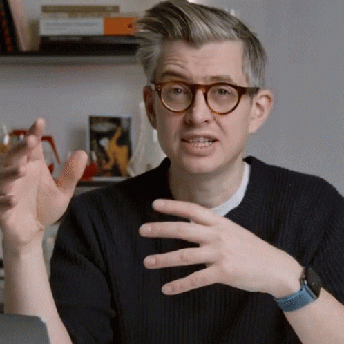

# Pour Lab 

A minimalistic React app designed to help coffee enthusiasts determine optimal brewing techniques. The app calculates custom pour schedules based on coffee variety, drying process, brewing method, grams of coffee, and water to ground coffee ratio. Deployed on GitHub Pages for easy access.

Disclaimer ⚠️
This app was developed for my own personal enjoyment 
The goal is to learn React and create a useful tool for myself.  

## Table of Contents

- [Pour Lab ](#pour-lab-)
  - [Table of Contents](#table-of-contents)
  - [Features 🧩](#features-)
  - [Demo 👀](#demo-)
  - [Technologies 🚀](#technologies-)
  - [License 📜](#license-)

## Features 🧩

- Customizable dropdown selection for brewing method and coffee variety/process
- Dynamic pour scheduling calculations based on user input
- Integration with OpenAI’s API to provide brewing advice
- Simple and responsive UI with Bootstrap styling
- Deployed to GitHub Pages for easy accessibility

## Demo 👀

You can view the app live [here](https://nosarabs.github.io/pour-lab-app).

## Technologies 🚀

- **React** – A JavaScript library for building user interfaces. ⚛️
- **Bootstrap** – Provides responsive styling for a clean and consistent UI. 🎨
- **OpenAI API** – Integrates AI-driven brewing advice based on user inputs. 🤖
- **GitHub Pages** – Hosts the app for easy access and sharing. 🌐

## License 📜

This project is open-source and available under the [MIT License](LICENSE).

